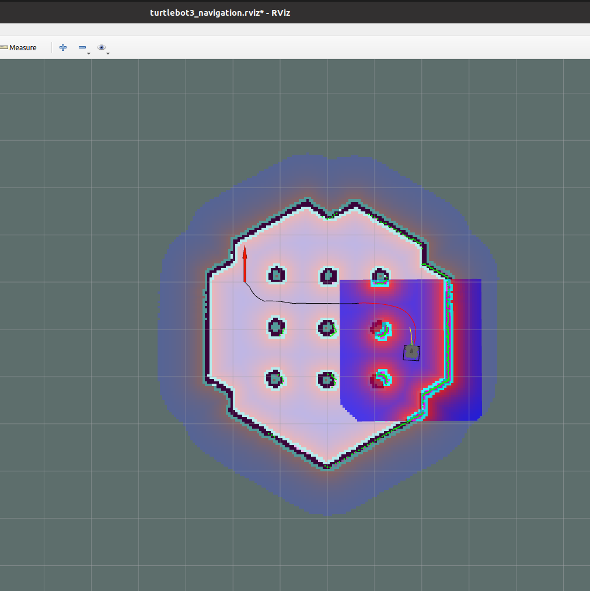
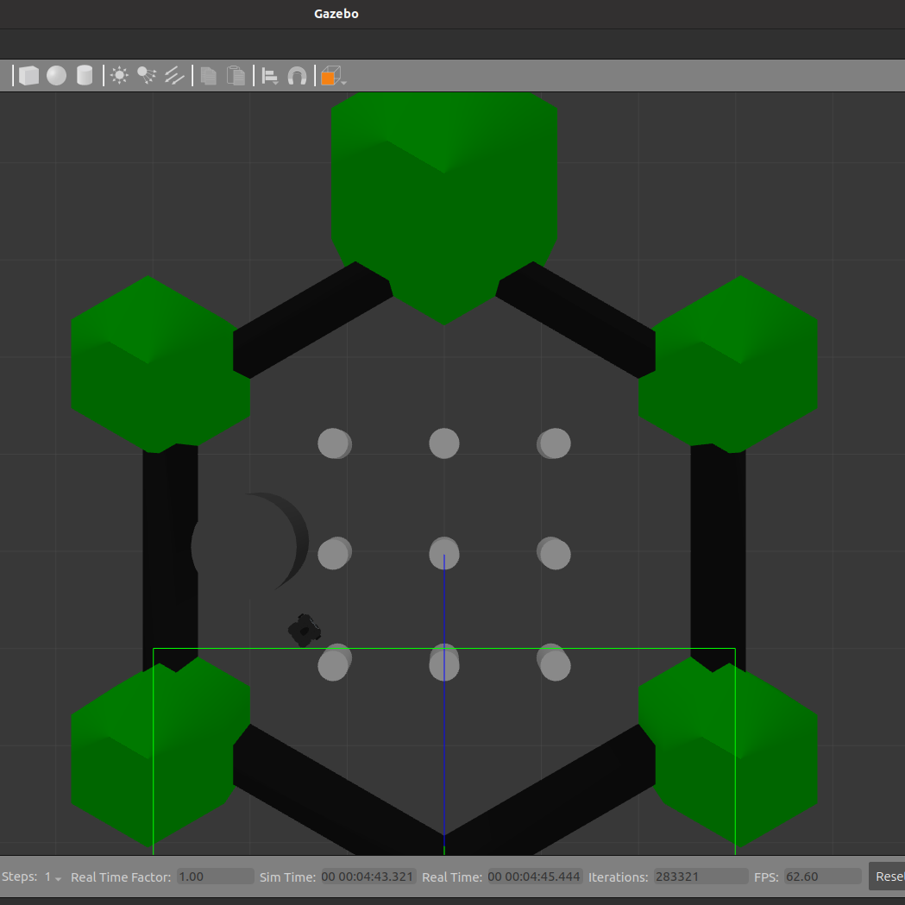

# ROS Turtlebot3 navigation and Control


## Overview
ROS Turtlebot3 Control is a ROS package designed for controlling a Turtlebot3 robot in a Gazebo simulation environment. 

Fig 1: Rviz image of the Turtlebot3 robot navigation


Fig 2: Image of the Gazebo simulation environment instance


## Package Structure

(```ros_turtlebot3_control/
├── CMakeLists.txt
├── launch/
│   └── turtlebot3_control.launch   # ROS launch files for starting the Gazebo simulation, navigation, and control modules.
├── package.xml
├── README.md
└── scripts/
    └── NavigationPlannerNode.py    # Python script for the navigation and obstacle avoidance.```)
 
 ### Prerequisites
 ROS Noetic installed on Ubuntu 20.04


## Dependencies
- `move_base_msgs`
- `turtlebot3_gazebo`
- `turtlebot3_navigation`


## Installation
1. Clone this repository into your catkin workspace:

    ```bash
    git clone https://github.com/goytomdesta/ros_turtlebot3_control.git
    ```

2. Build the package:

    ```bash
    catkin_make
    ```

3. Source the setup file:

    ```bash
    source devel/setup.bash
    ```

## Making Python Script Files Executable

4. After cloning the repository and building the package, you need to make the Python script file `NavigationPlannerNode.py` executable. 
This will allow you to run the script directly from the command line.

    Navigate to the directory containing the `NavigationPlannerNode.py` script file within your catkin workspace and run the following command:

    ```bash
    chmod +x catkin_ws/src/ros_turtlebot3_control/scripts/NavigationPlannerNode.py
    ```
    
    Check the shebang line at the top of the script (#!/usr/bin/python3) to match your Python interpreter. Modify it if necessary.

## Launching the Simulation
Launch the simulation using the provided launch file:

```bash
roslaunch ros_turtlebot3_control turtlebot3_control.launch

